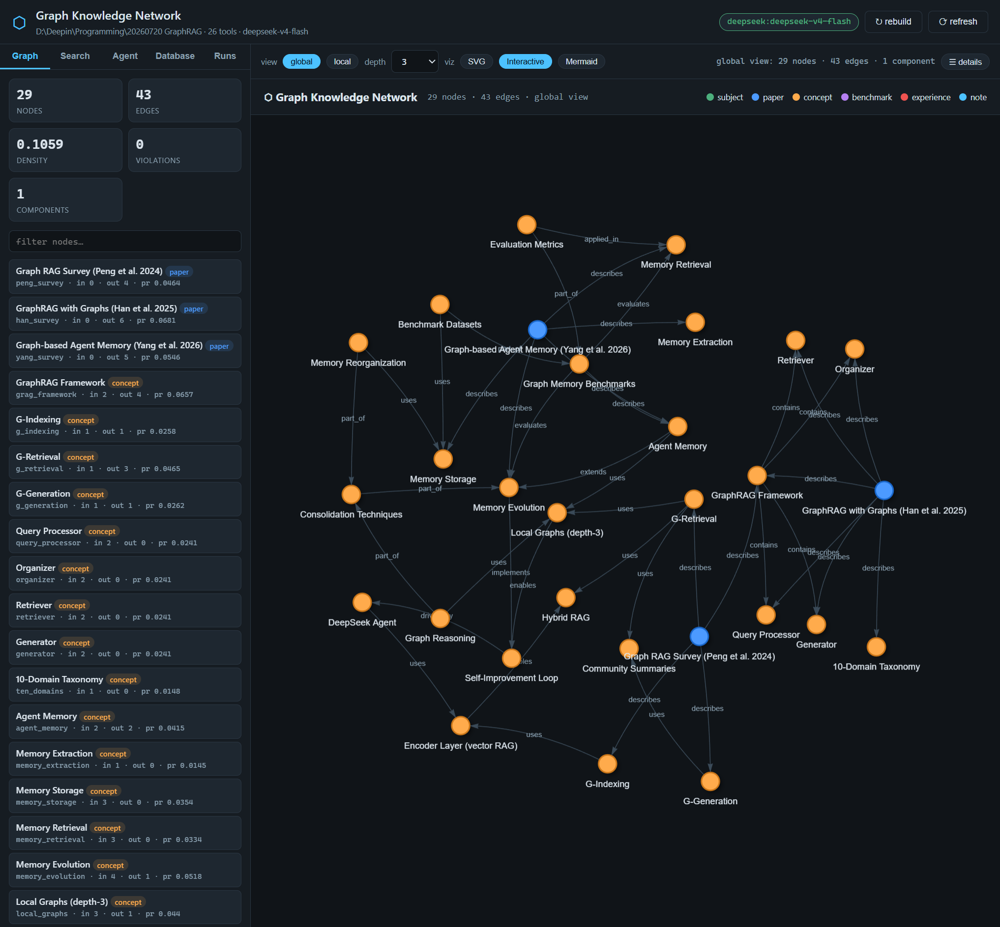

# ⬡ Graph Knowledge Network for Agentic Work

A **self-contained, local-first knowledge-graph platform** that lets LLM agents
operate on *nodes* through their **depth-3 local graphs**, grow the network
through a **recursive self-improvement loop**, and persist every node as a
**living Markdown note** with a version-control log — all unified by the
**Information Process Protocol v0.2.8**: every component is a declared IPP
node (Json File 𝔉 → Constructor Γ → Objects Ω + Executors Ξ) with the 17
design invariants, guardrail envelopes and hash-chained audits.


---

## ✨ Features

| Capability | What it does |
|---|---|
| 🌐 **Global graph** | typed, directed knowledge graph with §4.3a bidirectional consistency, backward compatible with the ScientificInfrastructure folder format |
| 🎯 **Local graphs (depth-3)** | every agent task is grounded in the node's depth-3 ego network — bounded working memory, no lost-in-the-middle |
| 🧠 **Encoder layer** | vector-based RAG extraction into nodes (chunk → embed → index → hybrid search) |
| 🤖 **DeepSeek agent** | OpenAI-compatible Chat Completions agent with a 26-tool IPP suite (four-phase tool lifecycle) |
| 🌱 **Recursive self-improvement** | external expansion + internal self-evolving (consolidation, graph reasoning, reorganization) + exploration, with dedup & per-run limits |
| 🗄️ **Note database** | every node = a `.md` file with YAML front-matter, `[[wikilinks]]`, and a **Version Control Log** at the bottom — knowledge accumulates and grows |
| 🖥️ **Web control center** | Flask + vanilla-JS SPA at `127.0.0.3:8000`: draggable SVG graph, PyVis-style interactive view, Mermaid flowcharts, vector search, agent console, note editor |
| 🧩 **IPP v0.2.8 runtime** | every component is an IPP node: Json File (𝔉) → Constructor (Γ) → n Objects (Ω) + n Executors (Ξ), 17 invariants, hash-chained audits, internal pipeline edges |

---



---

## 🏗️ Architecture

```
┌────────────────────────────────────────────────────────────────┐
│ Layer 0   Global graph (KGP)         tools/graph.py            │
│ Layer 1   Local graphs (depth-3)     tools/graph.py            │
│ Layer 2   Encoder layer (vector RAG) tools/encoder.py          │
│ Layer 3   DeepSeek agent (IPP loop)  tools/engine.py · tools/graph_tools.py · LLMs/deepseek/provider.py
│ Layer 4   Growth & self-improvement  tools/agents.py           │
│ IPP v0.2.8 Every component is an IPP node (F · Γ · Ω · Ξ)      ipp/ · */ipp.json
│ Extras    Note database · visuals    database/notes.py · ui/visuals.py │
└────────────────────────────────────────────────────────────────┘
```

```
Repo layout:
├── ipp/                    ← IPP v0.2.8 runtime (MAIN package): IPP_file (F), IPP_ports,
│                              IPP_object (Ω), IPP_executor (Ξ), IPP_constructor (Γ),
│                              IPP_registry (𝒢), IPP_verify (17 invariants)
├── tools/                  ← SHARED runtime + tool suite: graph, encoder, IPP, engine,
│                              agents, build, config + codex 19 tools + audit tools
│                              (+ build_cy3.py · IPP_runtime.py)
├── codex_growth/           ← GROWTH agent: engine/ + tools/ packages, each with its
│                              own ipp.json + IPP_object.py + IPP_executor.py
├── codex_RAG/              ← RAG agent: engine/ + tools/ IPP packages
├── codex_normal/           ← general agent: engine/ + tools/ IPP packages
├── LLMs/                   ← LLM backends + LLMs/ipp.json (llm node: chat · complete · chat_stream)
├── ui/                     ← Flask control center + Gradio chat + visuals.py
├── database/               ← note projects + notes.py store + database_tool/ (MUTATION tools)
├── graph_data/             ← generated: knowledge_graph.json, vectors/, export/, cy3/
├── assets/                 ← source materials (papers, extractions, notebooks, archive/)
├── requirements.txt        ← pinned deps with license audit (see §Licensing)
└── *.ipynb                 ← design + build & agents demo notebooks
```

---

## ⬡ IPP v0.2.8 — the Information Process Protocol runtime

The project is declared and executed through the **IPP v0.2.8** formal model
(`IPP_v0.2.8_Specification.md`). Every computational component is an **IPP
node**: a static **Json File** (𝔉) declared in its folder, constructed by the
**Constructor** Γ into 2n+1 independent runtime peers — n **Objects** Ω
(computation) + n **Executors** Ξ (guardrails & topology) + Γ (dormant).

| Component | Where | Role |
|---|---|---|
| 𝔉 — IPP Json File | `LLMs/ipp.json`, `codex_*/engine/ipp.json`, `codex_*/tools/ipp.json` | declarative channels + internal topology |
| 𝒢 — Graph Context | `ipp/IPP_registry.py` | deployment registry, candidates, supervisor intent |
| Γ — Constructor | `ipp/IPP_constructor.py` | 7-step protocol: build Ω, configure Ξ, resolve external τ*, wire internal edges |
| Ω — Object | `ipp/IPP_object.py` + per-folder `IPP_object.py` | handler H_k, ports Π=Φ×A×T, lifecycle FSM, state |
| Ξ — Executor | `ipp/IPP_executor.py` + per-folder `IPP_executor.py` | guardrail envelope ι→π→Ω→ι→ρ→τ*, hash-chained audit, internal flow control |
| ✓ — Verify | `ipp/IPP_verify.py` · `tools/IPP_runtime.py` | the **17 invariants** (I1–I17) |

```
LLMs/ipp.json ──► Γ ──► llm node         (chat · complete · chat_stream)
codex_X/engine/ipp.json ──► Γ ──► engine node (ground → chat internal blocking edge)
codex_X/tools/ipp.json ──► Γ ──► tools node   (invoke · list · describe)
```

**Guardrail envelope** (Axiom X1, no bypass): `ι_pre → π → [Ω.execute] →
ι_post → ρ → τ*_dispatch` — integrity hash, policy, handler, output hash,
hash-chained provenance (`audit_verify()`), edge dispatch with flow control
(`blocking` / `non_blocking` / `callback`). Internal edges carry payload
copies only — never state (I17). External topology is capability-space-
resolved against 𝒢 at construction (never declared in the file, I9) and
mutates only through recall (X6).

```python
from LLMs.IPP import llm_node
from tools.IPP_runtime import verify_node

node = llm_node()                          # Γ constructs the llm node
r = node.invoke('chat', [{'role': 'user', 'content': 'Reply: OK'}])
node.executors['chat'].audit_verify()      # hash chain
verify_node(node) or 'ALL 17 OK'           # the 17 invariants

# the codex agents build the same way (engine + tools + llm nodes):
from codex_growth import create_agent
agent = create_agent(graph, encoder, llm=llm)
agent.node.invoke('ground', {'task': '…', 'node_id': 'agent_memory'})
#   ↳ internal edge ground → chat (blocking) runs the grounded agent loop
```

---

## 🚀 Quickstart

```bash
# 1. environment (Python 3.10+)
conda create -n agentic_ai python=3.12
conda activate agentic_ai
pip install -r requirements.txt

# 2. configure the DeepSeek API key (OpenAI-compatible)
#    put DEEPSEEK_API_KEY=sk-... in LLMs/.env  (auto-loaded)
#    ⚠️  LLMs/.env is gitignored — never commit your key

# 3. build the graph from the bundled survey papers
python -c "from tools.build import build_graph, export_backward_compatible; \
g, e = build_graph(); print(g.summary())"

# 4. run the web control center → http://127.0.0.3:8000
python ui/server.py

# 5. (optional) verify the IPP v0.2.8 nodes — all 17 invariants
python verify_ipp.py       # → ALL IPP VERIFICATIONS PASSED
```

Programmatic use:

```python
from tools.build import build_graph
from LLMs.deepseek import DeepSeekProvider
from tools.agents import NodeAgent, GrowthAgent

graph, encoder = build_graph()                 # 23+ seed nodes from the surveys
llm = DeepSeekProvider()                       # deepseek-v4-flash

agent = NodeAgent(graph, encoder, llm=llm)
result = agent.operate("g_retrieval", "List the retrieval techniques in the local graph.")

growth = GrowthAgent(graph, encoder, llm=llm)
growth.expand("agent_memory", "Graph Memory Benchmarks", "motivation…")  # grows the graph
```

Offline demos: pass `MockProvider()` instead of `DeepSeekProvider()`.

---

## 🗄️ Note Database (the "growth" store)

Each project in `database/<project>/` is a graph whose **nodes are Markdown
notes** — the knowledge is the document, and the document accumulates:

```
database/
  <project>/
    project.json            ← project metadata + stats
    nodes/
      agent_memory.md       ← one .md per node:
                              • YAML front-matter (id, category, tags, version)
                              • # title + description + ## Content
                              • ## Links  →  `relation → [[Target]]`
                              • ## Version Control Log  (appended at the bottom)
    interactive.html        ← exported PyVis-style graph (auto-generated)
    assets/                 ← per-project attachments + node ↔ file manifest
      manifest.json         ← node_id → files: {role, path, size, sha256}
      README.md             ← human-readable node ↔ file table
      papers/ extracted/ datasets/ …  ← the actual files, copied per role
```

Every save bumps the version and appends a **Version Control Log** entry
(§4.4a of the ScientificInfrastructure spec) — so each node's history is
auditable and the knowledge "grows" like a living document. The graph ⇄ notes
sync is bidirectional (`NoteStore.sync_from_graph` / `load_to_graph`).

**Assets & provenance:** every non-Markdown file a node references (paper PDFs,
pypdf extractions, dataset files, research documents) is **copied into the
project's `assets/` folder** organized by role, and the **node → file
relationship** is recorded in `assets/manifest.json` — which node corresponds
to which file, with role, project-relative path, size and sha256. The notes'
`## Content` references those project-relative paths (portable, self-
contained).

**Example project — `database/calabiyau3fold/`:** the Calabi–Yau threefold
landscape (converted 2026-08-07 from `assets/20260806 CalabiYau3fold/`,
notebook `20260807 CalabiYau3fold Graph Network.ipynb`): 95+ notes (the seven
Hodge totals 17/28/29/66/80/81/92 with verified verdicts, famous manifolds,
constructions, papers, datasets), 55 asset files across `papers/ extracted/
datasets/ research/`, and a manifest mapping 31 nodes to their files. Serve it
with:

```bash
python ui/server.py --graph graph_data/cy3   # → http://127.0.0.3:8000
```

---

## 🤖 The Three Agents (all IPP, shared tools, tailored prompts)

| Agent | Purpose | Tool set | Chat |
|---|---|---|---|
| **`codex_growth`** | GROWS the network — improves node `.md` notes by considering new analysis/info (web search, file read), adds new edges, updates & adds new nodes | graph read + **database mutations** + web/file | `python ui/gradio_chat.py --agent codex_growth` |
| **`codex_RAG`** | Operates & understands the network, outputs information (the RAG mission) | retrieval only (local graphs, encoder, node read, summarize) | `python ui/gradio_chat.py --agent codex_RAG` |
| **`codex_normal`** | The usual codex agent — does general tasks | the full 19-tool suite | `python ui/gradio_chat.py --agent codex_normal` |

All three **share** `tools/` (the common tool suite composed of the original
codex tools + graph tools) and `LLMs/`, and each is an **IPP v0.2.8 node**: an
`engine/` package and a `tools/` package, each with its own `ipp.json` +
`IPP_object.py` + `IPP_executor.py` (constructed by Γ into Ω/Ξ peers), plus an
editable `system_prompt.md` with project-structure awareness and purpose-
tailored instructions.

### Traditional chat (Gradio)

```bash
python ui/gradio_chat.py            # → http://127.0.0.3:7860 (pick any agent; default codex_normal)
```

## 🖥️ Web UI

Run `python ui/server.py` → http://127.0.0.3:8000

- **Graph tab** — stats, node list, force-directed SVG (drag nodes, pan, zoom,
  double-click focus), node detail drawer
- **Visualization modes** — `SVG` | `Interactive` (PyVis-style network with
  physics + tooltips) | `Mermaid` (the dependency-flowchart format used by the
  ScientificInfrastructure notebooks)
- **Search tab** — vector RAG over the encoder layer
- **Agent tab** — run the three shared **codex agents** directly in the control
  center: `codex_normal` (general tasks + audits), `codex_RAG` (ask the
  network), `codex_growth` (improve notes / expand the network), via
  `POST /api/agent/chat` (or the streaming `POST /api/agent/chat/stream` SSE
  endpoint). The response **streams progressively** (thinking / messages / tool
  calls appear as they happen — no "stuck then dump"), each step collapsible
  like ChatGPT/Copilot, followed by the **full final answer**. The chat is
  **read-only**: file-write and graph-mutation tools are commented out
  (`chat_mode`).
- **Database tab** — create/open projects, export the graph to `.md` notes,
  edit notes and append version-log entries
- **Runs tab** — the version-control run log

### REST API

| Method | Endpoint | Purpose |
|---|---|---|
| GET | `/api/health` | provider, tools, workspace |
| GET | `/api/graph/summary` · `/api/graph/nodes` · `/api/graph/edges` | graph stats & topology |
| GET | `/api/graph/node/<id>` · `/api/graph/local/<id>?depth=3` | node detail · ego network |
| POST | `/api/search` | vector RAG `{query, k}` |
| POST | `/api/agent/node` · `/api/agent/grow` | Node agent · Growth agent |
| GET | `/api/visual/interactive` · `/api/visual/mermaid` | visualizations |
| GET | `/api/database/projects` · `/notes` · `/note/<id>` | note store |
| POST | `/api/database/create` · `/open` · `/sync` · `/note/update` | note store mutations |
| GET | `/api/runs` · `/api/export` · POST `/api/graph/rebuild` | ops |

---

## 📚 Concepts

- **Local graph** `L_k(u)` — the induced subgraph within `k` hops (default 3)
  of a node; the agent's bounded working memory. Both in/out edges; shortcuts
  kept.
- **§4.3a bidirectional consistency** — `∀X,Y: Y ∈ X.output ⇔ X ∈ Y.input`;
  every directed edge is stored once with two halves; validated after every
  mutation.
- **IPP** — every component (LLM, tool, graph query, encoder, agent) is an
  information processor `(Input, Φ, Output)`; tools run a four-phase lifecycle
  `resolve → validate → prepare → invoke`.
- **Growth guardrails** — semantic dedup, ≤5 new nodes/run, per-run limits,
  version-control logging on every note.

---

## 🗂️ Data & Sources

`assets/` bundles the three GraphRAG / agent-memory survey papers
(Peng et al. 2408.08921 · Han et al. 2501.00309 · Yang et al. 2602.05665),
their pypdf + OpenDataLoader-PDF extractions, the ScientificInfrastructure
folder-graph system, the Obsidian knowledge-graph notebook, and the Codex
Local IPP architecture analyses that inspired the agent design.

---

## ⚖️ Licensing

- This project: **MIT** (see `LICENSE`).
- **Every dependency is permissive** (MIT / BSD-3-Clause / Apache-2.0) — **no
  copyleft (GPL/AGPL/LGPL/EPL/MPL) packages anywhere**: `openai`
  (Apache-2.0), `numpy` (BSD-3-Clause), `flask` (BSD-3-Clause), `jsonschema`
  (MIT), `gradio` (Apache-2.0), and PDF extraction via **`pypdf`
  (BSD-3-Clause)** — the former PyMuPDF (AGPL-3.0) dependency was removed and
  its scripts rewritten. Full audit: see `requirements.txt` header.
- See the `assets/notebooks/` analyses for the IPP/MCP/ACP/KGP design sources.

---

## 🔐 Security & `.gitignore`

- **`LLMs/.env` holds the real DeepSeek API key** and is **gitignored** — never
  commit it. If it was ever committed, rotate the key immediately.
- The `.gitignore` also excludes generated artifacts (`graph_data/`,
  `database/`, `assets/extracted/`, `assets/odl_output/`) — they are
  regenerated by `tools/build.py` / `assets/scripts/`.
- The `codex_normal` agent's `review_top_threats` tool scans for exposed keys,
  secrets, and dangerous patterns before you publish.

---

## 📓 Notebooks

- `20260802 Graph Knowledge Network for Agentic Work.md.ipynb` — the design
  document (markdown-only, one `##` section per cell).
- `20260802 Graph Network Build & Agents.ipynb` — executable build + agents
  demo (kernel: `agentic_ai` / `agenti_ai`).
- `20260807 CalabiYau3fold Graph Network.ipynb` — Calabi–Yau threefold
  conversion: datasets, graph build, agents, note database + asset manifest
  (kernel: `agenti_ai`).

---

## 📜 Version Log

Per ScientificInfrastructure §4.4a, this README tracks its own revisions.

### v0.1.1 — 2026-08-07 (IPP naming convention + cleanup)

- **IPP modules renamed to `IPP_*.py`** everywhere for one consistent
  convention: `ipp/IPP_file.py`, `ipp/IPP_ports.py`, `ipp/IPP_object.py`,
  `ipp/IPP_executor.py`, `ipp/IPP_constructor.py`, `ipp/IPP_registry.py`,
  `ipp/IPP_verify.py`; `LLMs/IPP.py` (`llm_node`), `LLMs/IPP_object.py`,
  `LLMs/IPP_executor.py`; per-agent `codex_*/engine/IPP_object.py` +
  `IPP_executor.py` and `codex_*/tools/IPP_object.py` + `IPP_executor.py`;
  `tools/IPP.py` (legacy IPP v0.1 + ToolRegistry) and `tools/IPP_runtime.py`
  (`verify_node`). All `ipp.json` handler refs, imports and docs updated.
- **`codex_normal/chat.py` removed** — redundant legacy wrapper; all three
  agents launch uniformly via `python ui/gradio_chat.py [--agent …]`.
- **Interactive plot click → detail drawer**: clicking a node in the
  PyVis-style Interactive view now opens the right-hand detail drawer via
  `postMessage` (no more `alert()` popup); hover tooltips added.
- **Encoder index fix**: `graph_data/cy3/vectors/index.json` was empty after
  a rebuild — regenerated (2,295 chunks) so vector search works again.

### v0.1.0 — 2026-08-07 (IPP v0.2.8 full rewrite)

- **New main package `ipp/`** — the IPP v0.2.8 runtime: `IPP_file.py` (𝔉
  validation, R1–R4, I1), `IPP_ports.py` (Π = Φ×A×T, ten-layer Envelope),
  `IPP_object.py` (Ω lifecycle FSM), `IPP_executor.py` (Ξ guardrail envelope +
  hash-chained audit + internal flow control), `IPP_constructor.py` (Γ 7-step
  protocol + recall), `IPP_registry.py` (𝒢), `IPP_verify.py` (17 invariants).
- **Every component is now an IPP node with its own Json File, object and
  executor**: `LLMs/ipp.json` (llm node: chat · complete · chat_stream),
  `codex_*/engine/ipp.json` (engine node: ground → chat internal **blocking
  pipeline edge**), `codex_*/tools/ipp.json` (tools node: invoke · list ·
  describe). Public API: `LLMs.IPP.llm_node()`,
  `tools.IPP_runtime.verify_node()`.
- **`codex_growth` / `codex_RAG` / `codex_normal` reorganized** — each now
  has an `engine/` package and a `tools/` package (each with its own
  `ipp.json` + `IPP_object.py` + `IPP_executor.py`); `create_agent()`
  constructs the engine/tools/LLM nodes through Γ and attaches `engine.node`.
  The returned engines keep the full AgentEngine surface (`run_with_trace`,
  `chat_stream`, `bind_node`) — UI and Gradio unchanged.
- **Verified end-to-end** (`verify_ipp.py`): live DeepSeek chat/complete/
  stream through the llm node; tool list/describe/invoke through the tools
  nodes; the ground→chat internal pipeline (audit records the `internal`
  traversal); constructor-resolved external topology (engine.chat upstream =
  llm, downstream = tools); **ALL 17 invariants pass on every node**;
  server + live API chat regression-tested.

### v0.0.5 — 2026-08-07 (Calabi–Yau threefold graph project)

- **New `tools/build_cy3.py`** — seeds a 95+ node / 140+ edge knowledge graph
  from `assets/20260806 CalabiYau3fold/ResearchReferences/` (40 papers, 24
  concepts, 5 datasets, the seven target totals 17/28/29/66/80/81/92 with
  verified verdicts, 16 famous Hodge pairs), with ~2,300 encoder chunks from
  the 20 pypdf extractions. Persists to `graph_data/cy3/` (default GraphRAG
  graph untouched); rebuilds are idempotent and **preserve grown nodes**.
- **New notebook** `20260807 CalabiYau3fold Graph Network.ipynb` — dataset
  loading with fixed paths, headline statistics, graph build, local graphs,
  vector RAG, NodeAgent + GrowthAgent demos, backward-compatible export.
- **`ui/server.py --graph DIR`** — serve any custom graph folder
  (`knowledge_graph.json` + `vectors/index.json`); the rebuild button
  respects the custom graph.
- **Note database project `database/calabiyau3fold/`** — one `.md` note per
  node (YAML front-matter, `[[wikilinks]]`, VCL), plus **project `assets/`
  with a `manifest.json` node → file mapping** (role, path, size, sha256):
  all 55 referenced files (papers/extracted/datasets/research) copied into
  the project, notes referencing project-relative paths. The Database tab
  opens it by default.
- Research verdicts (17/28/66/81 special · 29 mild · 80 generic · 92
  notable-but-general) encoded into the total-node descriptions.

### v0.0.4 — 2026-08-02 (LLMs/deepseek subfolder)

- **`LLMs/` restructured** — every DeepSeek provider script now lives in
  `LLMs/deepseek/` (`provider.py` = `LLMResult`, `DeepSeekProvider`,
  `MockProvider`; plus `__init__.py` and README). `LLMs/api.py` remains the
  unified facade (`DeepSeekProvider`, `MockProvider`, optional `GrokProvider`).
- All consumers re-pointed from `LLMs.llm` → `LLMs.deepseek` (tools engine,
  3 agent engines, `tool_spawn_agent`, UI, notebook). Verified: imports,
  build, agents, Flask + Gradio + SSE streaming.

### v0.0.3 — 2026-08-02 (layout flatten: graph_network dissolved into tools/)

- **`graph_network/` dissolved** — its modules moved into their natural homes:
  `tools/` (config, graph, encoder, ipp, engine, agents, build, graph_tools),
  `LLMs/deepseek/provider.py` (providers), `database/notes.py` (NoteStore/Note/VCLogEntry),
  `ui/visuals.py` (visualizations).
- **Dead code removed** — `codex/` (broken legacy engine + tools) and
  `LLMs/deepseek|grok/` (un-importable) archived to `assets/archive/`.
- **Single Config** — `tools/config.py` is now the one `Config` (workspace +
  DeepSeek + guardrails + Pushover + conda extras); the shim is gone.
- **Circular-import-safe** — `tools/__init__.py` is lazy (PEP 562); engine →
  `tools.api` stays lazy.
- **Fixed runtime landmines** — `tool_spawn_agent` no longer imports the
  nonexistent `agents.api`; `httpx` added to `requirements.txt` (used by
  `web_search` / Pushover).
- All imports updated across agents, UI, notebooks; verified: build, tools,
  all 3 agents, Flask + Gradio + SSE streaming.

### v0.0.2 — 2026-08-02 (streaming agents, read-only chat, audits, packaging)

- **True streaming agent output** — `POST /api/agent/chat/stream` (SSE) renders
  thinking / messages / tool calls / final answer progressively; Gradio streams
  too. No more "stuck then dump".
- **Foldable agentic process** — each step (🧠 thinking · 💬 message · 🛠 tool ·
  ↩ result) is a collapsible block, ChatGPT/Copilot-style; final answer is
  rendered Markdown (marked.js) in a full scrollable box.
- **Read-only chat** (`chat_mode`) — file-write + graph-mutation tools are
  commented out in the chat surface.
- **Audit tools** — `review_top_threats`, `standard_check`, `advanced_check`
  (read-only greps over files + graph).
- **Three codex agents** live in the main control center (growth / RAG / normal),
  sharing `tools/` and `LLMs/` with per-agent `system_prompt.md` and empty
  `<agent>/tools/` folders.
- **PyMuPDF (AGPL-3.0) → pypdf (BSD-3-Clause)** — zero copyleft dependencies;
  scripts rewritten, extractions + graph_data regenerated.
- **Project `.gitignore`** — ignores `LLMs/.env` (API key), `graph_data/`,
  `database/`, generated extractions; README security section added.

### v0.0.1 — 2026-08-02 (initial)

- Created the project README documenting the Graph Knowledge Network for
  Agentic Work: features, 5-layer architecture, repo layout, quickstart,
  note database, web UI (Flask control center + Gradio chat), three codex
  agents (growth / RAG / normal), REST API, concepts, data sources, and the
  permissive-only licensing posture (PyMuPDF/AGPL removed, pypdf adopted).
